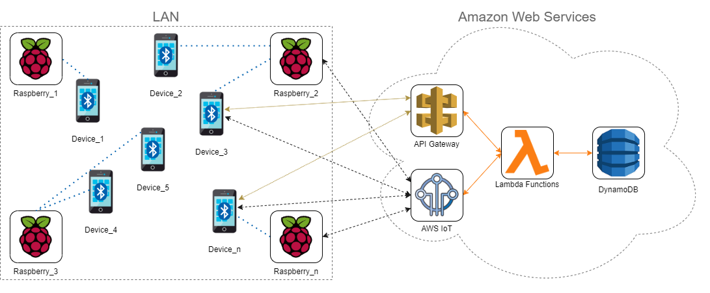
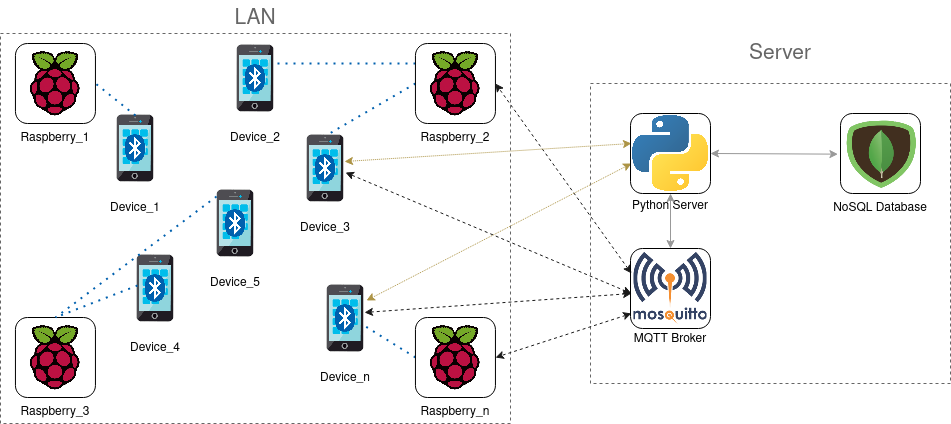

# Trace Me Now

Trace Me Now is an open-source framework which helps developers in building their own IoT-based indoor localization and tracking systems. Its aim is to let developers easily develop systems that need to localise, trace, and keep track of people in an indoor environment. 

Unlike outdoor localization, where GLONASS but mostly GPS play a big role, indoor localization nowadays is still under study, and lately it acquired a lot of interest, particurarly in the IoT sector. The most recent literature proposes a large variety of techniques and technologies to achieve indoor localization, but a technology that stands out the most is *BLE (Bluetooth Low Energy)*, alongside *RSSI (Received Signal Strength Indicator)* measurements technique.

Since the purpose was to let people build cheap systems — as much as possible —, and let end users use it with basically no costs, BLE has been the main choice as it is not a power- and cpu-intensive technology. Furthermore RSSI allows to easily localise a target — with more or less error, related to the environment —.

So, the idea is having users' smartphones as target devices, continuously sending BLE packets in broadcast, and place a certain number of Raspberry Pi boards within the indoor environment. In this way users do not need to be carrying some other device besides their own smartphones. Each Raspberry Pi will be listening for BLE packets, and based on the information in them, will be able to localise and keep track of devices, *i.e.* users. 

Raspberry Pis, as well as smartphones, are able to communicate with a back-end. This framework gives the possibility to the developers to choose between building a serverless or an on-premise back-end.
- Raspberry Pis will have an internal status about all the devices seen so far. This status is local for each Raspberry Pi, that's why they periodically synchronise with a back-end, which keeps a global status of the whole system.
- Smartphones, besides being the target device for localising users, can be the end client themselves, so they are able to communicate with the back-end as well.

This process is handled through an events system, made up using the MQTT protocol. Events are generated by the Raspberry Pi boards, and the back-end is provided with a series of triggers so that it can react to events and provide a response (or notification) for each specific event. Plus, the back-end provides you with a series of APIs, which can be used by your smartphone client, a possible web client, or even by the Raspberry Pis themselves.

All of these events and APIs are provided by default and you will not have to manage anything, but the framework will manage everything for you. 

*If you want to know more about defaults events and APIs, smartphone and Raspberry Pi processes, take a look to each framework component's README file, everything is detailed in there.*

You can take advantage of all this self-handled process and define your own custom events or APIs. For instance, you can make your Raspberry Pi generate a new event, when something happens, to be triggered by your back-end, and generate a custom notification based on it. This notification can be then consumed by your smartphone or your custom end client.

### General Serverless Architecture

  

### General On-premise Server Architecture

  

The above are two generalized architectures that you can build using this framework. If you choose to build a serverless architecture, then you can take advantage of the *Amazon Web Services*, and the framework will help you in building new functions, setup a database, deploy new triggers and APIs.  
If you want an on-premise solution, instead, the framework provides you with a Python module which allows you to easily setup your server, add new events and APIs to the default provided ones, and each component of your server — *i.e.* a NoSQL DB, an MQTT broker, and a Python server — will run in an isolated *Docker Container*, so that you will not have to install dependencies and setup anything on your machine, but everything is ready to be used.

## Possible use cases

Such a tool can be useful in many scenarios which nowadays are emerging that require indoor localization and tracking functional requirements. In fact, since COVID-19 pandemic has started in the beginning of 2020, multiple scenarios and applications have tackled with this problem, such as the *Immuni* application present in Italy, and many other scenarios that have adopted very rough solution which are not "smart". For example, restaurants, pubs, and bars, are keeping track of people on paper, asking them to write their name and telephone number on it, using a pen which has been used by many other people, with high risk of infection. Not to mention long waiting queues outside supermarkets, pharmacies, offices, etc.

Besides the COVID-19 scenario, other use cases can benefit from such tool. Just think of a company which has got a large number of employees. It may happen that an employee marks his/her badge and consequently leaves the site, meanwhile resulting at work. Or even a single employee can bring and mark other collegues badges and then leave. In this case, a system built with Trace Me Now can help, since employees' badges can be their smartphone, and the building can be provided with a certain number of Raspberry Pi boards which sense the environment and detect if every single employee is at work, arrived in late, left the site during his/her shift, and a lot more.

Another scenario could be a home automation system. For instance, you want your house to detect when you come back home and automatically turn on some light, turn the air purifier on, open the shutters, etc. Plus, you can make your house follow you, so that as you move from room to room, your house can automatically turn off the provious room light and turn on the next one. You can even build an app for remote check who is home and remote control your smart devices. Possibilities are limited only by creativity.

This repository provides an example project, which consists of a possible company badge marking system, more or less as described previously. The example is provided in the `example/badge-marking-system` folder, and further informations are detailed in the corrisponding README file.
