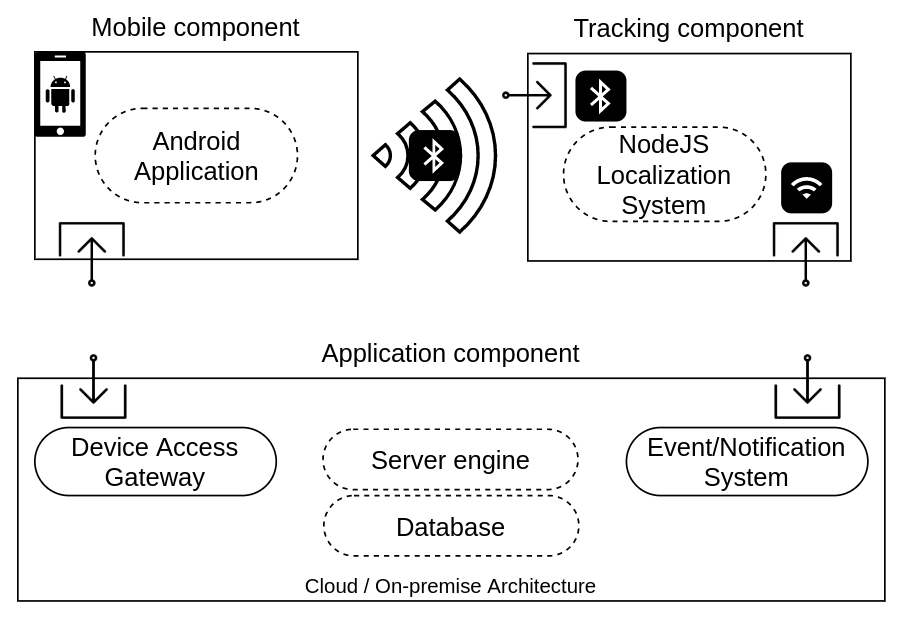

# Trace Me Now
TraceMeNow, an open-source framework for developing applications exploiting Indoor Positioning System (IPS), based on Bluetooth Low Energy, compatible with standard and cheap devices, suitable for any scenario. TraceMeNow allows programmers to build software thanks to a modular architecture simplifying the implementation of tracking and localization modules within an indoor environment using low-cost devices. Each component of the framework has a dedicated library with default functionalities designed to support the developer in several situations. Additionally, every method can be easily customized, and new features can be introduced if needed. Furthermore, the framework includes the possibility to exploit cloud computing resources to gain scalability and manage large scenarios.

The system implemented with the framework consists of mobile nodes, whose position is unknown, and several localization nodes, with known locations, placed within the indoor environment communicating with an application module acting as a server.

The position estimation and the communication between the nodes rely on BLE.
BLE is designed for short-range wireless transmission of small amounts of data with low energy and cost, granting a convenient trade-off between power consumption and accuracy. TraceMeNow exploits the one-to-many communication provided by BLE called broadcasting, enabling data sent to any listening device in range. Specifically, the mobile nodes transmit BLE packets in broadcast, allowing the nearby anchor node to detect and localize them.

TraceMeNow is designed to guide the developer through the implementation and integration of the IPS within any application, thanks to the libraries available for each system component. In detail, the framework proposes several default implementations useful in most scenarios as well as methods to modify the existing features and/or introduce new ones. For instance, other localization techniques can be used, or additional components can be included.

*More informations about each component are avaible in the dedicated README file.*

## General Architecture

The modular architecture of TraceMeNow includes mobile nodes, tracking nodes, the communication protocol, and the application module. The mobile node can be any device with BLE and Wi-Fi interface on which an application built with TraceMeNow is installed. This enables the node to continuously broadcast a message with some defined information via BLE while the Wi-Fi interface is used to interact with the application module using a specific communication protocol.
A group of tracking nodes is responsible for the localization process and consists of embedded systems supporting the two wireless technologies used. TraceMeNow provides the localization system exploiting the BLE interface and the communication protocol using Wi-Fi.
The application module handles the whole IPS and can be hosted on a Cloud architecture or an on-premise one. It contains a lightweight server engine, a database to store the collected data, maintaining the global status of the system, and the TraceMeNow communication protocol based on the Event/Notification system.

 

## Use Case: Attendance Management System

Indoor positioning based application can be useful in many scenarios. The COVID-19 pandemic started in the beginning of 2020 showed how tracking and indoor localization is required in multiple scenarios and applications, such as *Immuni* application adopted in Italy. Places like restaurants, pubs, shops and so on, need to keep track of people and the most common system is using paper, asking to each customer to write the contact info on it, using a pen which has been used by many others, increasing the risk of infection. Moreover, system like that has increased the waiting time outside markets, pharmacies, offices and so on. An application with tracking capabilities could avoid these problems but it requires specific knowledge and dedicated devices.

The examples are countless. Within the repository we describe an application developed with TraceMeNow designed for a real-world scenario to demonstrate the flexibility and ease of use of our framework. We developed Attendance Management System~(AMS) that helps to track employees' attendance monitoring their presence and punctuality by exploiting indoor localization.
Employee attendance tracking is a priority for many employers, making easier to schedule work shift and identifying any attendance issues. Nowadays, offices and factories provide access badges to their employees to report the start, the end of the work shift, and the breaks, checking the respect of the working time. However, this kind of system is not safe and can be easily tricked, for example, by clocking in and then leaving the workplace or by giving the badge to a colleague who clocks in for multiple employees not present. Therefore, access badges are not reliable and, in addition, the infrastructure needed to realize the system is usually expensive since it requires proprietary hardware and software and frequent maintenance.
An architecture composed of an IPS and an application specifically designed can overcome the problems of traditional access card systems, introducing innovative solutions. The AMS developed with TraceMeNow aims to be one of these solutions, providing an effective and low-cost system easy to install and maintain.
The idea is to turn employees' smartphones into badges using an Android application. A group of devices installed within the workplace senses employees' movements reporting the information to a central server monitoring the building. 
The application provides a registration phase to gain the information and the working time of the employee. Based on that data, the smartphone shows a notification if the user leaves the building during the work shift, asking for a reason. All the information acquired and the movements detected are registered within a database accessible through a web interface.
The use of TraceMeNow reduces the cost and the effort needed to create AMS since the default implementations included in the libraries already provide the basis for all the components. In addition, the installation of the IPS is easy since the Raspberry Pi boards can be used as the tracking node and placed everywhere within the building, thanks to their tiny size. Finally, the upfront investment is small considering that smartphones with BLE are widely used, Raspberry Pi boards are cheap, and the server does not require any specific requirements.

More informations about the example is available in [Attendance Management System](https://github.com/isislab-unisa/trace-me-now/tree/main/example/attendance-management-system)