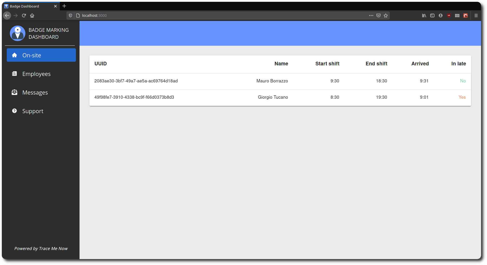
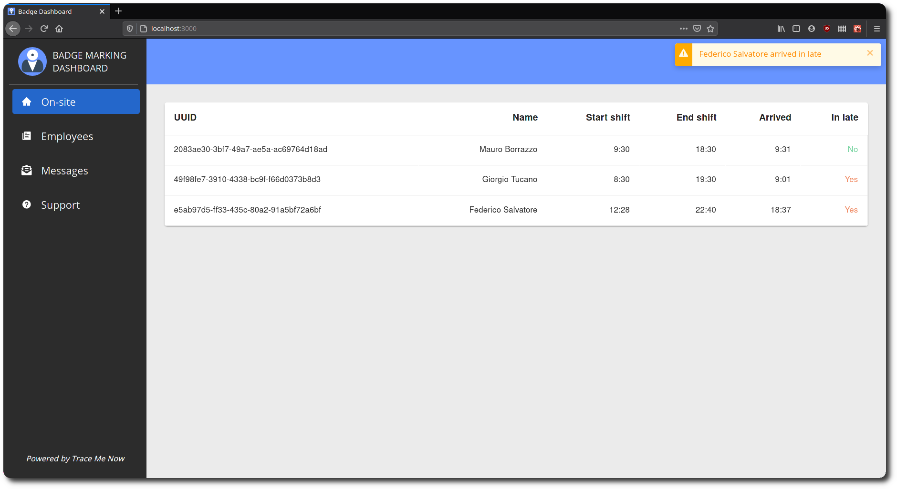
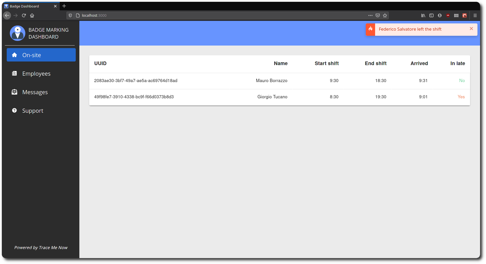
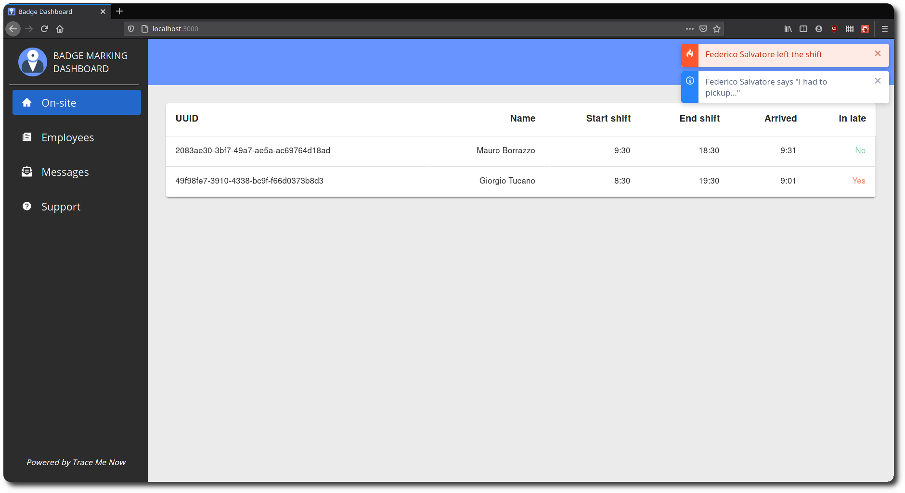
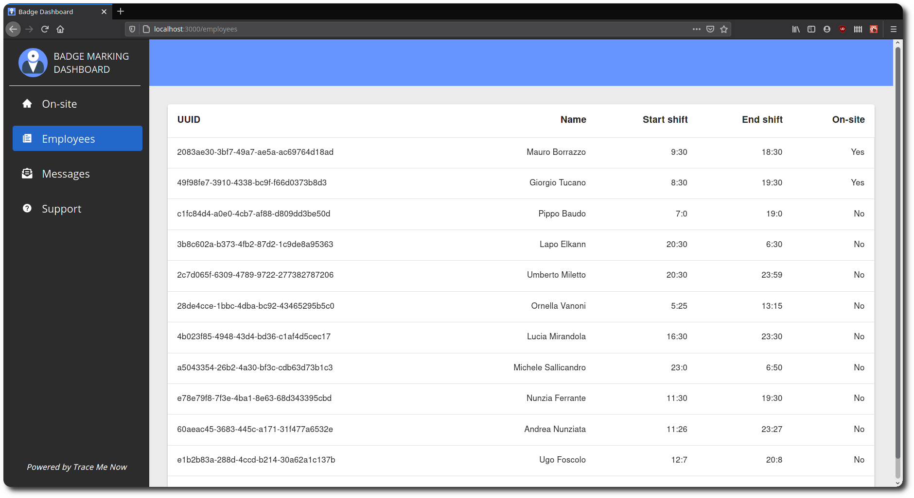
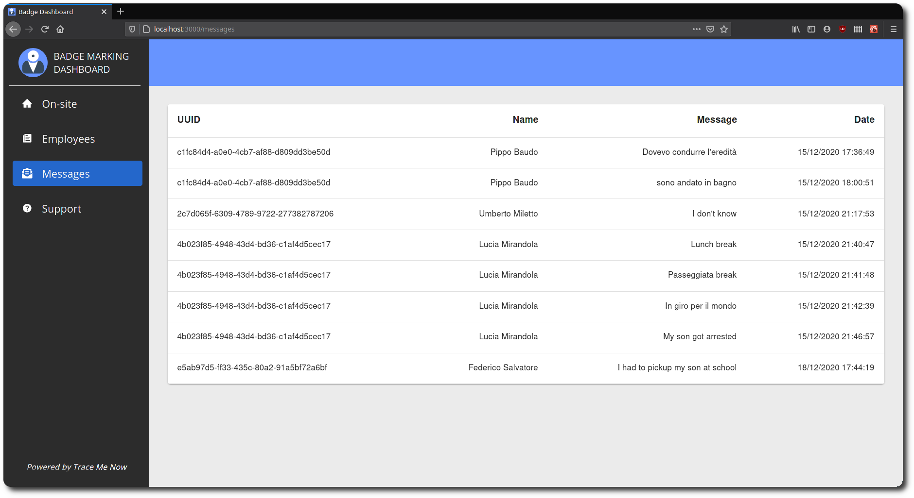

# Web interface

A web interface built from scratch using React provides access to all the data of the system, including employees' information and notifications responses. 

The web interface provides the list of all the employees, those within the workplace or who left it at least once, a section with all the employees' messages.
From this dashboard, an admin of the company can monitor the employees. It is provided a notification system that notifies when an employee arrives, when arrives in late, when leaves the company during or out the shift, and reasons reported by the employees when they are leaving the shift.

## Overview

### On-site view



The web interface screen displaying all the employees within the building.

### On-site: new employee notification



The web interface screen displaying the reception of a notification regarding the arrival of a new employee.

### On-site: employee exit notification



The web interface screen displaying the reception of notifications regarding the exit of an employee during the workshift.

### On-site: employee leaving reason



The web interface screen displaying the reception of notifications regarding the employee's reason.

### Employees view



The web interface screen displaying a list of all employees of the company showing whether they are working or not.

### Messages view



The web interface screen displaying all the reason provided by employees with the corrisponding date and time.

## Run and test

To run the web interface first create a `.env` file within the root folder using the following format:

```
SERVER_IP=<your_server_ip>
SERVER_PORT=<your_server_port>
BROKER_IP=<your_broker_ip>
BROKER_PORT=<your_broker_port>
```

Within the project directory the web application can be executed in developer mode using the command:

### `npm start`

The web interface can be accessed using the browser at [http://localhost:3000](http://localhost:3000).

Any error will be in the browser console.

The test runner can be launched in the interactive wathc mode using: \
See the section about [running tests](https://facebook.github.io/create-react-app/docs/running-tests) for more information.

### `npm test`

To build the app navigate to the `build` folder and use the command:

### `npm run build`

Your app is ready to be deployed!

See the section about [deployment](https://facebook.github.io/create-react-app/docs/deployment) for more information.

To remove the build dependency from the project use the command:

### `npm run eject`

**Note: this is a one-way operation. Once you `eject`, you can’t go back!**