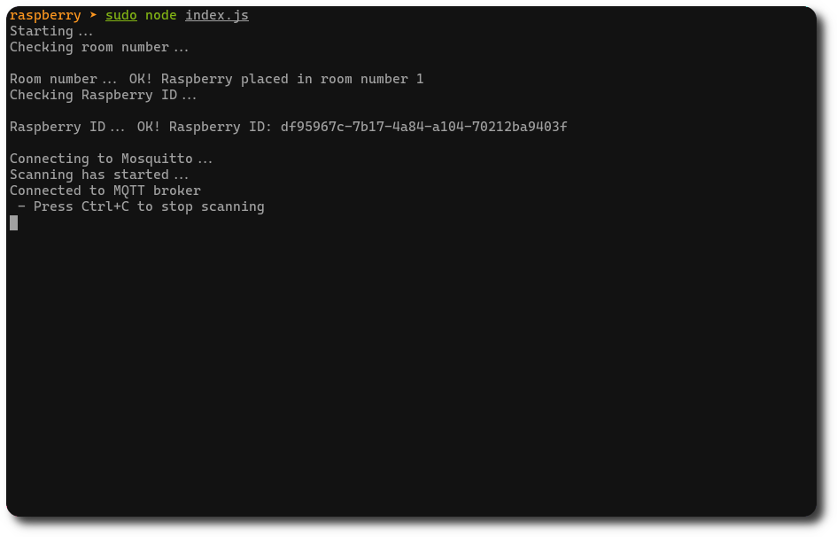

# Badge detector

This is the module which runs on all the Raspberry Pi boards installed within the company site. Each Raspberry Pi is able to sense the employees' smartphones and check whether they are on-site or not, if they arrived in late, and if they leave their shift.

## Overview



When executed, the Raspberry Pi will sense the environment and communicate with the back-end, in order to update the global status of all devices seen so far.

## Run and test

You can install your favorite linux distro on your Raspberry Pi, and before starting, you will have to install the `nodejs` package.

Before executing it, you have to create a `.env` file at the same level of the `index.js` file

```
NODE_ENV=development

ON_PREMISE=true

MQTT_ADDRESS=<your_broker_ip>
MQTT_PORT=<your_borker_port>

ROOM_NUMBER=<your_room_number>
```

Once this is done, run your raspberry in production with

```bash
~$ sudo node index.js
```

`sudo` command is needed because the access to the Raspberry Pi bluetooth module is required.
