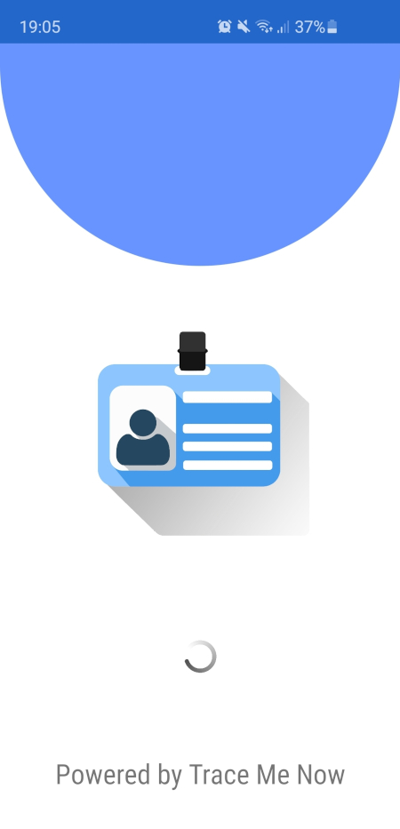
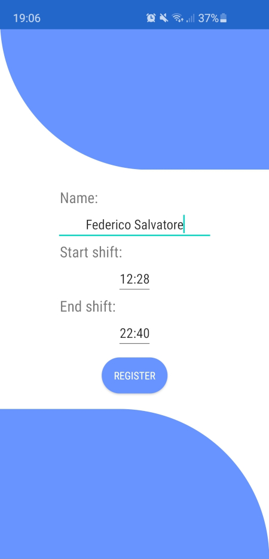
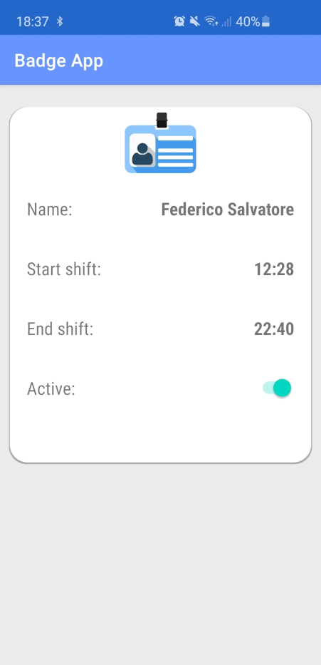
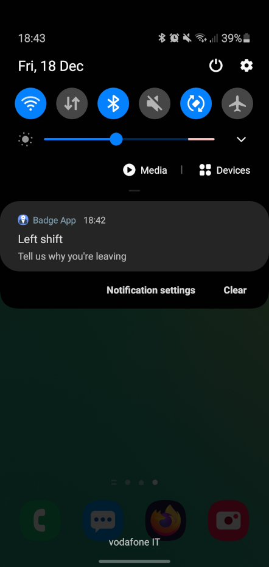
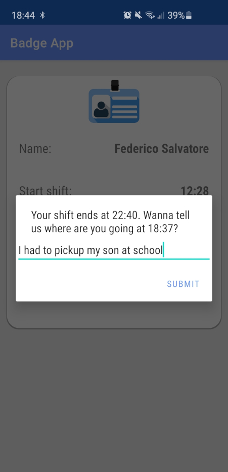

# Android application

The application turns the employee's smartphone into an access badge automatically detected and tracked when located within the workplace. The badge constantly sends BLE packets in broadcast with the employee data allowing the tracking nodes to identify and track them. Using this mechanism, the badge is automatically registered as soon as it goes in or out of the building. The system can notice if the employee leaves the workplace during the shift by sending a notification on the smartphone. The application does not allow other operations until a reason for the movement is provided. Finally, the badge can be disabled when needed, such as when the employee is not at work or whenever the localization should not be performed.

## Overview

### Splash screen

### Sign-up

 On the first start, a registration form is shown where the employee inserts name and working time to sign-up to the system.

### Badge

The image shows the badge that can be activated or disabled by the employee, for example while not within the workplace or when the badge does not need to be localized.

### Notification

When an employee leaves the site during the working shift, a notification is shown asking to report a reason for the movement.

### Reason

The application does not allow other operations until a valid reason is provided. 

## Run and test

The application requires Android Studio to be installed on a smartphone. Simply open the root folder using Adroid Studio and use the standard procedure to install it.