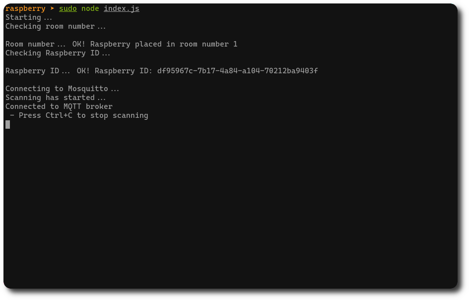

# Detector

The detector application turns the Raspberry Pi boards into detectors, allowing them to scan the building and detect the employees' smartphones. The boards communicate with the central server reporting the information collected.

## Overview



When running the application let the Raspberry Pi sense the environment and communicate with the central server, in order to update the global status of the system.

## Run and test

The detector application runs over a NodeJS engine requiring only an operating system compatible. For instance, any Linux distribution is compatible. 

To run the application 
 - install the NodeJS packages within the `package.json`file;
 - create a `.env` file within the same folder of the `index.js` file:

```
NODE_ENV=development

ON_PREMISE=true

MQTT_ADDRESS=<your_broker_ip>
MQTT_PORT=<your_borker_port>

ROOM_NUMBER=<your_room_number>
```

- run the application using :

```bash
~$ sudo node index.js
```

`sudo` is needed because of the bluetooth library used.
