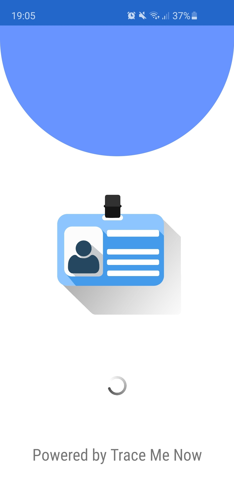
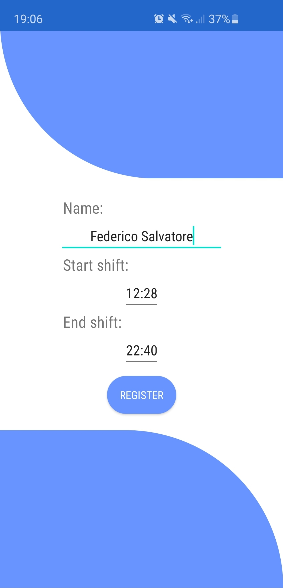
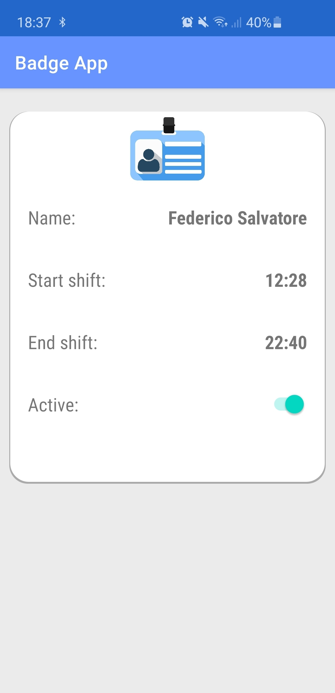
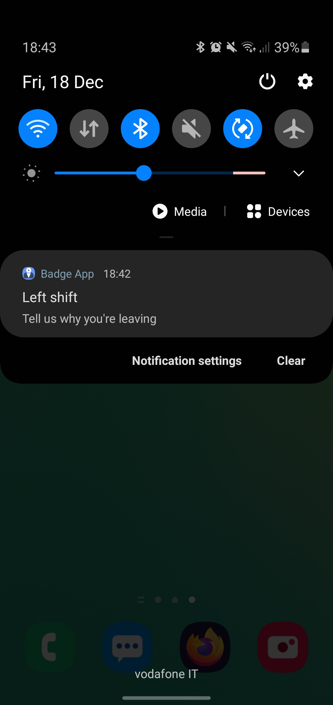
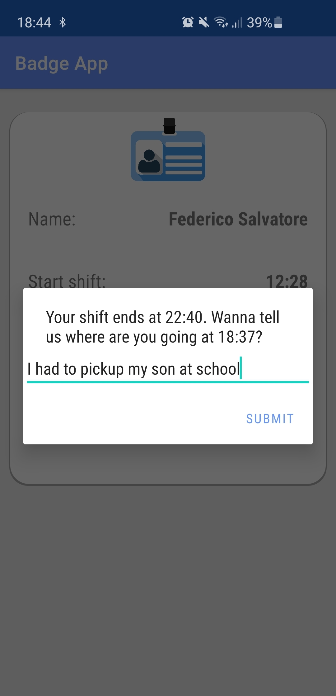

# Badge Marking App

This app represents the real badge of the employees. Each employee does not need to be carrying an old rough badge, but his/her smartphone will be the badge itself. Through this app, the smarthone will constantly send BLE packets in broadcast containing the employee data in order to be detected by the Raspberry Pi boards installed within the company site. In this way, the badge will be automatically "marked" as soon as the employee enters within the building, and will be detected if he/she leaves the site during the shift.

## Overview

### Splash screen

### Sign up

An employee can easily register by specifying his/her name, start-shift time, and end-shift time.

### Badge

This is the badge of each employee, reporting all of the personal informations. The employee can even choose to activate or disable the badge, for example while not at work, the badge does not need to be localized.

### Notification

When an employee leaves the site during the working shift, the employee receives a notification which asks to report a valid reason.

### Motivation

At this point, is mandatory for the employee to provide a reason, otherwise the app will not let the user to do anything.

## Run and test

To test this app, you need to install Android Studio. Then, open the root folder through Android Studio and install it on your smartphone.
