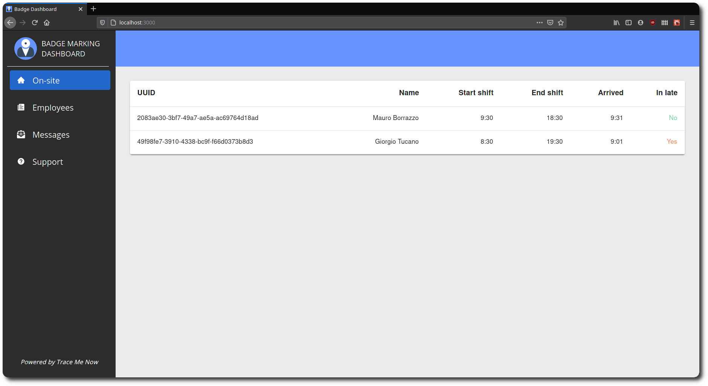
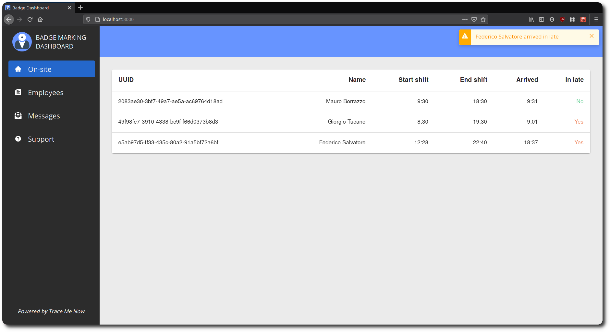
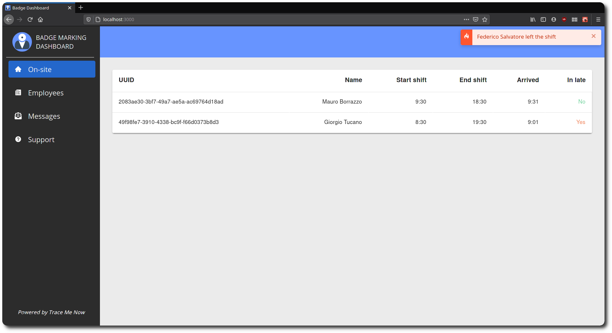
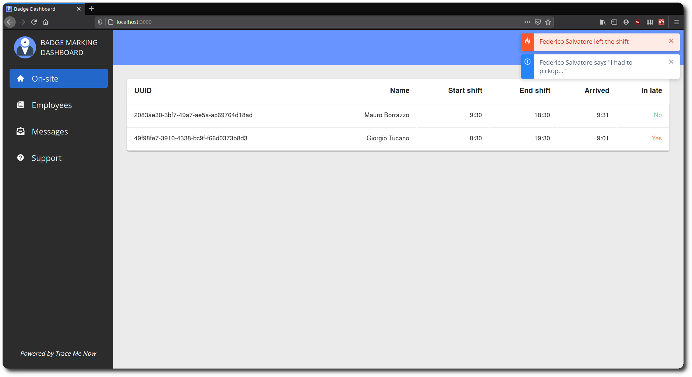
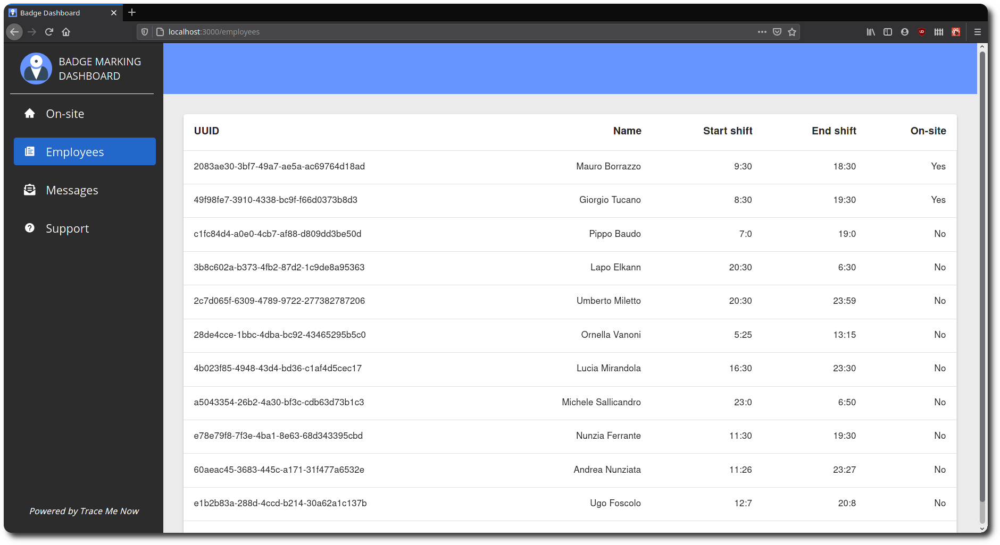
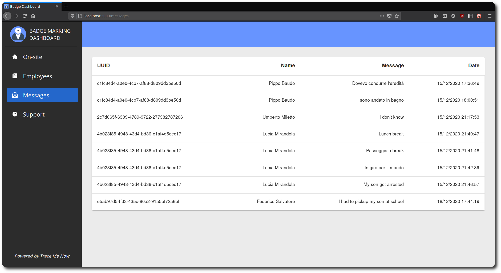

# Admin dashboard

This is a web client for the admin side, built from scratch using React. 

From this dashboard, an admin of the company can monitor the employees. It is provided a notification system that notifies when an employee arrives, when arrives in late, when leaves the company during or out the shift, and reasons reported by the employees when they are leaving the shift.

Through this platform, so, an admin can see a list of all the employees, a list of on-site employees, and a list of the aforementioned messages.

## Overview

### On-site view



This view allows the admin to see all the employees that are currently on site.

### On-site: new employee



As soon as an employee arrives the admin recevices a notification through the dashboard, and from the dashboard itself, the admin can check if the employee arrived in time or in late, based on his/her shift.

### On-site: employee leaves the shift



If an employee leaves the building during his/her shift, the admin will be promptly notified.

### On-site: employee leaves the shift



The employee is required to give a reason about why he/she is leaving, and the admin will receive such notification.

### Employees view



Here the admin che see a list of all employees of the company, and check whether they are at work or not.

### Messages view



Here the admin can check all the reports from the employees about why they left their shift, with the corrisponding date and time.

## Run and test

Before starting the project, create a `.env` file in the root fo the project having this form

```
SERVER_IP=<your_server_ip>
SERVER_PORT=<your_server_port>
BROKER_IP=<your_broker_ip>
BROKER_PORT=<your_broker_port>
```

Then, in the project directory, you can run:

### `npm start`

It runs the app in the development mode.\
Open [http://localhost:3000](http://localhost:3000) to view it in the browser.

The page will reload if you make edits.\
You will also see any lint errors in the console.

### `npm test`

Launches the test runner in the interactive watch mode.\
See the section about [running tests](https://facebook.github.io/create-react-app/docs/running-tests) for more information.

### `npm run build`

Builds the app for production to the `build` folder.\
It correctly bundles React in production mode and optimizes the build for the best performance.

The build is minified and the filenames include the hashes.\
Your app is ready to be deployed!

See the section about [deployment](https://facebook.github.io/create-react-app/docs/deployment) for more information.

### `npm run eject`

**Note: this is a one-way operation. Once you `eject`, you can’t go back!**

If you aren’t satisfied with the build tool and configuration choices, you can `eject` at any time. This command will remove the single build dependency from your project.

Instead, it will copy all the configuration files and the transitive dependencies (webpack, Babel, ESLint, etc) right into your project so you have full control over them. All of the commands except `eject` will still work, but they will point to the copied scripts so you can tweak them. At this point you’re on your own.

You don’t have to ever use `eject`. The curated feature set is suitable for small and middle deployments, and you shouldn’t feel obligated to use this feature. However we understand that this tool wouldn’t be useful if you couldn’t customize it when you are ready for it.

