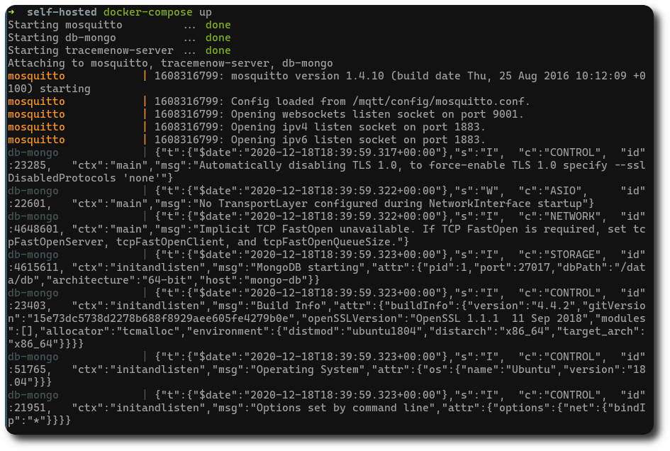
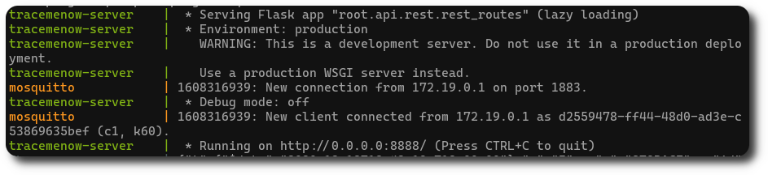

# Badge Marking Server

This module is the server, which has to run on a machine able to run docker containers, *e.g.* a Linux machine. This module provides an MQTT broker, a NoSQL database, and the Trace Me Now python server customized for the badge marking system. This server will communicate with all the Raspberry Pis and all the smartphones, offering APIs and handling events.

## Overview



This module just has to be started using `docker-compose`. It will run three different containers: a Mosquitto MQTT broker, a MongoDB server, and the Trace Me Now python server.



You are sure that the server is running if you see these lines in your logs.

## Run and test

All you have to do here is moving to the root folder of the module and run

```bash
~$ docker-compose up
```